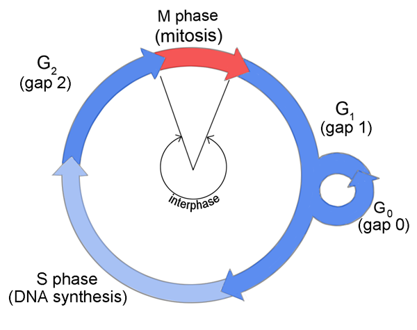

<!-- Limit image width and height -->

<!-- Center image on slide -->

<!-- Italic -->

<!-- Bold -->

--- .segue .dark 
## Recap

--- .segue .dark .nobackground
## Rakutsükkel

--- &div .masthead

http://tpall.github.io/Rakutsyklikontroll

---
## Rakutsükkel

- Rakutsükkel on järjestikuste sündmuste jada mille käigus rakk duplitseerib kõik oma koostisosad ja jaguneb kaheks tütarrakuks.
- Rakutsüklit kontrolliv 'masinavärk' on universaalne kõigis organismi rakutüüpides.
- Raku rakutsüklisse sisenemist ja 'masinavärgi käivitamist' reguleerivad raku väliskeskkonna signaalid.
- Rakutsüklis on neli järjestikust faasi **G1** $\rightarrow$ **S** $\rightarrow$ **G2** $\rightarrow$ **M**.
- Mittejagunev rakk on vaikeolekus (*quiescence*) ehk **G0** faasis.

---
## Rakutsükli käivitamist reguleerivad rakuvälised signaalid

- Eksponentsiaalselt kasvav imetajarakk peab peale igat raku jagunemist otsustama, 
    - kas kasvada ja jaguneda veel üks tsükkel või 
    - jääda vaikeolekusse.
- Seda otsust mõjutavad mitogeensed kasvufaktorid - kui neid on piisavalt siis rakk jätkab jagunemist, vastasel juhul jääb rakk vaikeolekusse.

---
## Rakutsükli käivitamist reguleerivad rakuvälised signaalid

Keskkonna signaalid, mis rakku jagunema/mittejagunema mõjutavad, pärinevad erinevatest allikatest:

- türosiin kinaas retseptorid (mitogeenid),
- G-valk retseptorid (GPCR),
- TGF-$\beta$ retseptorid,
- toitainestaatus.

---
## Ka rakutsüklist väljumist reguleerivad rakuvälised signaalid

Ka raku vaikeolekuse minek võib olla aktiivselt reguleeritud.

- TGF-$\beta$ on üks prominentsemaid anti-mitogeene (tuumorsupressorgeen SMAD4 18q21.2!).
- Vaikeolek on rakkudel enamasti pöörduv.
- Rakke mis enam ei jagune ja on terminaalselt diferentseerunud nimetatakse **post-mitootilisteks**, nt. neuronid.

---&twocol
## Rakutsükli faasid

Rakutsüklis on neli üksteisele järgnevat faasi:

***=left

- **G1** algab peale mitoosi ja kestab kuni DNA replikatsiooni alguseni S faasis,
    - rakk kasvab ja valmistub sisenema S faasi.
- **S-faas**is toimub genoomse DNA süntees.
- **G2 faas** on intervall DNA sünteesi eduka lõpu ja mitoosis toimuva kromosoomide lahknemise vahel,
    - suhteliselt lühike,
    - mitoosis vajalike valkude süntees.
- **M-faas** mitoos.

***=right

---&twocol
## Mitoosi faasid

***=left

M-faasis toimub kromosoomide lahknemine

- **Profaasis** toimub kromosoomide kondenseerumine.
      - Moodustub **mitoosikääv**.
- **Metafaasis** joonduvad õdekromatiidid.
- **Anafaasis** toimub õdekromatiidide lahknemine poolustele.
- **Telofaasis** moodustub uuesti tuumamembraan ja tuum.
- **Tsütokinees**: moodustub kaks tütarrakku.

***=right

**Mitoosi faasid vesiliku kopsurakus**

Pilt: DOI: 10.1126/science.1082177

---
## Rakkude kasv vs jagunemine

- Kui rakk on aktiivses kasvu-jagunemise tsüklis, siis peab see rakk kohe peale mitoosi läbimist valmistuma uueks jagunemiseks.
- Selleks peab rakk 'kahekordistama' oma suuruse.
- Pärmi katsed on näidanud, et **raku suurus valitseb rakutsükli üle: väikesed rakud ei jagune**.
- Mutatsioonid mis kiirendavad rakutsükli kulgu põhjustavad väiksemate rakkude tekke.
- Rakkude kasv toimub G1 faasis.

Mutation of Tsc1 Increases Cell and Organ Size. Source: DOI: 10.1016/S0092-8674(01)00333-6 

--- 
## Rakutsükli kontrollpunktid ehk *checkpoints*

Raku *checkpoint controls* tagavad, et toimuks
- Tuuma tsükli koordineerimine raku kasvu ja pooldumisega.
- Replikatsioon peab toimuma vaid üks kord rakutsükli jooksul.
- Replikatsioon peab eelnema kromosoomide lahknemisele.
- Kromosoomide lahknemine peab omakorda olema toimunud enne tsütokineesi e. raku jagunemist.

---
## *Checkpoints*

- G1-S DNA kahjustuste kontrollpunkt: S-faasi sisenemine on blokeeritud kui genoom on vigane.
- S-faasi kontroll: replikatsioon aeglustub või seiskub vastusena DNA kahjustustele.
- G2-M kontroll blokeerib raku mitoosi sisenemise kuni genoomi replikatsioon S-faasis on lõpule viidud. 
- M faasis kontrollpunkt mis blokeerib sisenemise anafaasi kuni kõik kromosoomid on korrektselt käävile kinnitunud.
- eksisteerib veel hilise G2 dekatenatsiooni kontroll mis monitoorib, et kromosoomid ei oleks omavahel 'sõlmes'.

--- &twocol
##

***=left

Chromosomal aberrations in RAD17 flox/− cells. Metaphase chromosome spread of cells with indicated genotype 5 d after Ad–Cre infection. (A) Normal diploid metaphase spread found in RAD17 +/+cells. (B) Normal diploid metaphase spread found inRAD17 flox/+ cells. (C) Chromosomal abnormalities in RAD17 flox/− cells. Arrows point to gapped or broken chromosomes. (D) Metaphase chromosome spread from RAD17 flox/− cells with partially endoreduplicated chromosomes.

***=right

