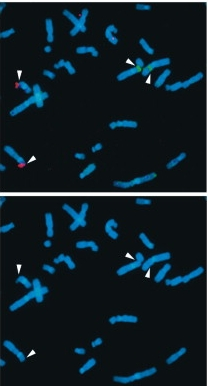

<!-- Limit image width and height -->

<!-- Center image on slide -->

<!-- Italic -->

<!-- Bold -->

--- .segue .dark 
## Recap

--- .segue .dark .nobackground
## Rakutsükkel

--- &div .masthead

http://tpall.github.io/Rakutsyklikontroll

---
## Rakutsükkel

- Rakutsükkel on järjestikuste sündmuste jada mille käigus rakk duplitseerib kõik oma koostisosad ja jaguneb kaheks tütarrakuks.
- Rakutsüklit kontrolliv 'masinavärk' on universaalne kõigis organismi rakutüüpides.
- Raku rakutsüklisse sisenemist ja 'masinavärgi käivitamist' reguleerivad raku väliskeskkonna signaalid.
- Rakutsüklis on neli järjestikust faasi **G1** $\rightarrow$ **S** $\rightarrow$ **G2** $\rightarrow$ **M**.
- Mittejagunev rakk on vaikeolekus (*quiescence*) ehk **G0** faasis.

---
## Rakutsükli käivitamist reguleerivad rakuvälised signaalid

- Eksponentsiaalselt kasvav imetajarakk peab peale igat raku jagunemist otsustama, 
    - kas kasvada ja jaguneda veel üks tsükkel või 
    - jääda vaikeolekusse.
- Seda otsust mõjutavad mitogeensed kasvufaktorid - kui neid on piisavalt siis rakk jätkab jagunemist, vastasel juhul jääb rakk vaikeolekusse.

---
## Rakutsükli käivitamist reguleerivad rakuvälised signaalid

Keskkonna signaalid, mis rakku jagunema/mittejagunema mõjutavad, pärinevad erinevatest allikatest:

- türosiin kinaas retseptorid (mitogeenid),
- G-valk retseptorid (GPCR),
- TGF-$\beta$ retseptorid,
- toitainestaatus.

---
## Ka rakutsüklist väljumist reguleerivad rakuvälised signaalid

Ka raku vaikeolekuse minek võib olla aktiivselt reguleeritud.

- TGF-$\beta$ on üks prominentsemaid anti-mitogeene (tuumorsupressorgeen SMAD4 18q21.2!).
- Vaikeolek on rakkudel enamasti pöörduv.
- Rakke mis enam ei jagune ja on terminaalselt diferentseerunud nimetatakse **post-mitootilisteks**, nt. neuronid.

---&twocol
## Rakutsükli faasid

Rakutsüklis on neli üksteisele järgnevat faasi:

***=left

- **G1** algab peale mitoosi ja kestab kuni DNA replikatsiooni alguseni S faasis,
    - rakk kasvab ja valmistub sisenema S faasi.
- **S-faas**is toimub genoomse DNA süntees.
- **G2 faas** on intervall DNA sünteesi eduka lõpu ja mitoosis toimuva kromosoomide lahknemise vahel,
    - suhteliselt lühike,
    - mitoosis vajalike valkude süntees.
- **M-faas** mitoos.

***=right

---&twocol
## Mitoosi faasid

***=left

M-faasis toimub kromosoomide lahknemine

- **Profaasis** toimub kromosoomide kondenseerumine.
      - Moodustub **mitoosikääv**.
- **Metafaasis** joonduvad õdekromatiidid.
- **Anafaasis** toimub õdekromatiidide lahknemine poolustele.
- **Telofaasis** moodustub uuesti tuumamembraan ja tuum.
- **Tsütokinees**: moodustub kaks tütarrakku.

***=right

**Mitoosi faasid vesiliku kopsurakus**

Pilt: DOI: 10.1126/science.1082177

---
## Rakkude kasv vs jagunemine

- Kui rakk on aktiivses kasvu-jagunemise tsüklis, siis peab see rakk kohe peale mitoosi läbimist valmistuma uueks jagunemiseks.
- Selleks peab rakk 'kahekordistama' oma suuruse.
- Pärmi katsed on näidanud, et **raku suurus valitseb rakutsükli üle: väikesed rakud ei jagune**.
- Mutatsioonid mis kiirendavad rakutsükli kulgu põhjustavad väiksemate rakkude tekke.
- Rakkude kasv toimub G1 faasis.

Mutation of Tsc1 Increases Cell and Organ Size. Source: DOI: 10.1016/S0092-8674(01)00333-6 

--- 
## Rakutsükli kontrollpunktid ehk *checkpoints*

Raku *checkpoint controls* tagavad, et toimuks
- Tuuma tsükli koordineerimine raku kasvu ja pooldumisega.
- Replikatsioon peab toimuma vaid üks kord rakutsükli jooksul.
- Replikatsioon peab eelnema kromosoomide lahknemisele.
- Kromosoomide lahknemine peab omakorda olema toimunud enne tsütokineesi e. raku jagunemist.

---
## *Checkpoints*

- G1-S DNA kahjustuste kontrollpunkt: S-faasi sisenemine on blokeeritud kui genoom on vigane.
- S-faasi kontroll: replikatsioon aeglustub või seiskub vastusena DNA kahjustustele.
- G2-M kontroll blokeerib raku mitoosi sisenemise kuni genoomi replikatsioon S-faasis on lõpule viidud. 
- M faasis kontrollpunkt mis blokeerib sisenemise anafaasi kuni kõik kromosoomid on korrektselt käävile kinnitunud.
- eksisteerib veel hilise G2 dekatenatsiooni kontroll mis monitoorib, et kromosoomid ei oleks omavahel 'sõlmes'.

--- &twocol bg:LightCyan
## Rad17: genoomi replitseeritakse ainult üks kord 

Rad17 sensorvalgu fosfrüleerimine ATRi poolt on vajalik DNA-kahjustuste poolt indutseeriud G2-faasi blokiks.

***=left

Komosoomi aberratioonid RAD17 flox/− rakkudes. Metafaasi komosoomid:
- Katkenud komosoomid (all vasak, nool). 
- Endoreduplitseerunud kromosoomid (all parem).

***=right

---&twocol bg:LightCyan
## ATR replikatsiooni *check*

***=right

- Seriin-treoniin kinaas ATR tagab fragiilsete saitide stabiilsuse. 
- **ATR aktiveeritakse vastuseks üheahelalisele DNA-le.** 
- Aktiveeritud ATR fosforüleerib CHK1 kinaasi ja käivitatakse signaalirada mis viib rakutsükli blokini.

***=left

---&twocol bg:LightCyan
## BUB1: käävi kontrollpunkt

**Käävi kontrollpunkt (*spindle assembly checkpoint*, SAC) hoiab ära aneuploidia tekke.**

***=left

- Mutatsioonid mitoosikäävi kontrollpunktis võib põhjustada kromosomaalse ebastabiilsuse ja aneuploidsuse, üle 90% tahketest kasvajatest sisaldab kromosomaalseid aberratsioone.
- BUB1 funktsiooni eksperimentaalne pärssimine on piisav rakkudes aneuploidse fenotüüpi tekkeks.

***=right

See BUB1-vaigistatud rakk on kaotanud kromosoomid 1 ja 6. 

---
## G1 restriktsioonipunkt

**Tagab mitogeense kontrolli rakutsükli kulgemise üle.** 

- Varases- ja keskmises G1 faasis on S-faasi sisenemine seerum sõltuv.
    - Samuti on rakud tundlikud TGF-$\beta$ anti-mitogeensele toimele.
- Hilises G1 faasis on rakud juba pühendunud S-faasi sisenemisele ja ei sõltu enam rakuvälistest signaalidest.

---
## Embrüonaalsed tüvirakud

- ES rakkudel ei ole restriktsioonipunkti.
- Varases embrüogeneesis ja ES rakkudel koosneb rakutsükkel ainult G1 ja S-faasist.
- ES rakud jagunevad autonoomselt.
- Embrüonaalsed tüvirakud jagunevad sümmeetriliselt - tekib kaks identset tütar rakku.
- Diferentseerumise surub alla LIF (*Leukaemia inhibitory factor*) läbi Jak-STAT3 signalisatsiooni.

Pilt: G1 cell-cycle control and cancer. Joan Massagué. Nature 432, 298-306(18 November 2004). doi:10.1038/nature03094

---
## Ka rakutsükli masinavärki reguleerivad kinaasid

Rakutsükli kinaaside (**CDK**) substraadid:

- Tsentrosoomi valke (*CP110*) fosforüleeritakse G1/S üleminekul tsentrosoomi duplitseerumiseks.
- Enne S-faasi aktiveeritakse replikatsioonikompleks (*Treslin*).
- *Histoonide* fosforüleerimine S ja M faasis kromatiini kondenseerumiseks.
- Tuumamebraani valkude (*Lamiin*) fosorüleerimine põhjustab tuumamembraani lagunemise M-faasis.

---
## Rakutsükli kinaasid (CDK)

- CDK on Ser/tre-kinaasid.
- 40% aa järjestusest identsed.
- **CDK aktiveerub seostumisel tsükliiniga**.
    - tsükliin E + CDK2 kompleksi kinaasne aktiivsus tõuseb 400000 korda.
- Tsükliinid tagavad ka substraat spetsiifilisuse.

Mechanism of CDK activation revealed by the structure of a cyclinA-CDK2 complex. Jeffrey, P.D.,  Russo, A.A.,  Polyak, K.,  Gibbs, E.,  Hurwitz, J.,  Massague, J.,  Pavletich, N.P. (1995) Nature 376: 313-320

--- &twocol
## Iga tsükliin paardub kindla kinaasiga kindlas rakusükli faasis
 
***=left

***=right

Tsükliini kinaas | Tsükliin | Rakutsükli faas
-----------------|---------|----------------
CDK4/6 | D1, D2, D3 | G1
CDK2 | E1, E2 | S
CDK2 | A | S
CDC2 (CDK1) | A | S/G2
CDC2 | B | M

---
## Tsükliinide hulk rakus muutub rakutsükli käigus

- Tsükliine kontrollitakse läbi proteolüütilise lagundamise.
- Tsükliini järkjärguline tõus ja kiire lagundamine tagab rakutsükli 'hammasrataste' liikumise ühes sunas.
- **D-tsükliinid erinevad: nende puhu ei toimu järske kõikumisi rakutsükli käigus.**
- **D-tsükliinid on reguleeritud mitogeensete sinaalide poolt.**

---
## Erinevad mitogeensed rajad konvergeeruvad tsükliin D regulatsioonil

Kasvufaktorid stimuleerivad kiire tsükliin D taseme tõusu rakus, samuti kasvufaktorite 'ära võtmine' koekultuuri tingimustes viib tsükliin D lagundamiseni (poolestuseg ~30 min).

Kasvufaktorite rajad mis kontrollivad tsükliin D ekspressiooni:
- GF $\rightarrow$ **türosiin kinaas reseptorid** $\rightarrow$ Ras $\rightarrow$ Raf/RalGDS $\rightarrow$ Fos/Jun $\rightarrow$ D1
- GF $\rightarrow$ **HER2/Neu** $\rightarrow\rightarrow\rightarrow$ Sp1 $\rightarrow$ D1
- **Wnt** $\rightarrow$ **$\beta$-kateniin** $\rightarrow$ Tcf/Lef $\rightarrow$ D1
- Tsütokiinid $\rightarrow$ tsütokiini retseptorid $\rightarrow$ **Jak $\rightarrow$ STAT** $\rightarrow$ D1
- **Hedgehog** $\rightarrow$ Patched $\rightarrow$ Smoothened $\rightarrow$ **Gli** $\rightarrow$ D1
- Erinevad ligandid $\rightarrow$ erinevad retseptorid $\rightarrow$ IKK $\rightarrow$ **NF-$\kappa$B** $\rightarrow$ D1

---
## Kolme D-tüüpi tsükliini induktsioonimuster erineb

Signaali allikas | Signaalirada | D tsükliini isovorm
-----------------|--------------|------------------
RANK retseptor | NF-$\kappa$B | D**1**
Prolaktiini retseptor | Jak/Stat | D**1**
Östogeeni retseptor | AP1 (Fos/Jun) | D**1**
*Focal adhesion kinase* |  | D**1**
HER2/Neu | E2F ja Sp1 | D**1**
Wnt-Frizzled | $\beta$-kateniin-Tcf/Lef | D**1**
Bcr/Abl |   | D**2**
FSH retseptor | cAMP | D**2**
erinevad mitogeenid | Myc | D**2**
IL-4/7 retseptor |  | D**2**
IL-5 retseptor | STAT3/5 | D**3**
 | E2F transkriptsiooni faktorid | D**3**

---
## Tsükliin D-CDK4/6 lükkavad raku läbi Restriktsiooni-punkti

- Rakud vastvad rakuvälistele mitogeensetele signaalidele kuni R-punktini.
- **Peale R-punkti läbimist on tsükliinide E $\rightarrow$ A $\rightarrow$ B regulatsioon automaatne ja autonoomne.**

---
## Lisaks tsükliinidele reguleerivad tsükliin-sõltuvaid kinaase ka CDK inhibiitorid (CdkI)

Praeguseks on kirjeldatud seitse erinevat CdkI-d.
- INK4 valgud (**in**hibitors of CD**K4**), mis inhibeerivad spetsiifiiselt ainult CDK4 ja CDK6
    - **p16^INK4A** , p15^INK4B , p18^INK4C , p19^INK4D .
- **p21^Cip1** , **p27^Kip1** , p57^Kip2 : inhibeerivad kõiki teisi tsükliin-CDK komplekse.

Crystal structure of the p27Kip1 cyclin-dependent-kinase inhibitor bound to the cyclin A-Cdk2 complex. Russo, A.A.,  Jeffrey, P.D.,  Patten, A.K.,  Massague, J.,  Pavletich, N.P. (1996) Nature 382: 325-331

Structural basis for inhibition of the cyclin-dependent kinase Cdk6 by the tumour suppressor p16INK4a. Russo, A.A.,  Tong, L.,  Lee, J.O.,  Jeffrey, P.D.,  Pavletich, N.P. (1998) Nature 395: 237-243.

---
## TGF-$\beta$ indutseerib p15^INK4B

- **TGF-$\beta$ peamine raku jagunemist pidurdav mehhanism töötab läbi p15^INK4B**.
- p15^INK4B blokeerib tsükliin D-CDK4/6 komplekside moodustumise ja inhibeerib olemasolevaid.
- Ilma aktiivse tsükliin D-CDK4/6 pole rakutsükkel võimeline arenema läbi varase ja keskmise G1 faasi R-punktini.
- Kui rakk on juba R-punkti läbinud pole enam D-CDK4/6 aktiivsus vajalik.
- Peale R-punkti muutub rakk 'tundetuks' ka TGF-$\beta$ inhibeerivale toimele.
- [CDKN2A/B lookus 9p21.3 on üks sagedamini muteerunud piirkondi eri tüüpi vähkides](http://rpubs.com/tapa741/tuumorsupressorgeenid) (vt. Supplementary Table 3).

---
## p21^Cip1 aktiveeritakse vastusena stressile

- p21^Cip1 toimib läbi terve rakutsükli.
- TGF-$\beta$ indutseerib nõrgalt ka p21^Cip1 .
- **Peamine p21^Cip1 induktor on DNA kahjustused**.
- p21^Cip1 inhibeerib E-CDK2, A-CDK2, A-CDC2, B-CDC2 komplekse.
- Kui DNA kahjustused on parandatud, siis võetakse p21^Cip1 -blokk maha.
- p21^Cip1 inhibeerib ka DNA replikatsiooni masinavärgi valku PCNA (*proliferating cell nuclear antigen*).

Pilt: p21 (A, punane) blokeerib PCNA-l (sliding clamp) DNA polümeraasi seostumiskoha (B, C). http://www-bioc.rice.edu 

---
## Mitogeenne signalisatsioon inhibeerib p21Cip1 ja p27Kip1

**PKB/Akt inhibeerib p21Cip1 ja p27Kip1 tuuma lokalisatsiooni**.
- HER-2/neu-vahendatud raku jagunemine käib läbi Akt aktivatsiooni, 
- Akt seostub p21Cip1 ja fosforüülib selle treoniin-145, põhjustades tsütoplasma lokalisatsiooni.
- Akt raja blokeerimine dominant-negatiivse Akt mutandiga taastab p21Cip1 tuuma lokalisatsiooni ja rakkude jagunemist inhibeeriva toime.
- Sarnaselt toimub p27Kip1 inhibitsioon, seal fosforüülib Akt treoniin-157.
- Aktiveeritud Akt ekspresseerivad rakkudes ei suuda p27WT tekitada G1 arresti.
- Tsütoplasmaatiline p27 esines 41% (52/128) inimese primaarsetes rinnavähkides kus on kõrge Akt aktivatsiooni ([Liang et al. 2002](http://www.nature.com/nm/journal/v8/n10/full/nm761.html)).
- Tsütoplasmaatiline p27 korreleerub halva prognoosiga.

---&twocol
## p21Cip1 ja p27Kip1 seostumine on vajalik D-CDK4/6 aktivatsiooniks

***=left

- Primaarsed hiire fibroblastid, milles puuduvad nii p21 ja p27 ei suuda moodustada aktiivseid tsükliin D-CDK komplekse, 
    - ekspresseerivad palju vähem tsükliin D ning
    - neis ei lokaliseeru  tsükliin D tuuma.
- Tsükliin D-CDK4/6 tase tõuseb rakus varases-keskmises G1 faasis ja korjab ära p21 ja p27 nii, et see ei saa inhibeerida tsükliin E-CDK2.

***=right

p21/p27 dko rakkudes on vähem tsükliin D-CDK komplekse [Cheng et al. 1999](http://emboj.embopress.org/content/18/6/1571.long).

---&twocol
## RB fosforülatsioon reguleerib restriktsioonipunkti läbimist

***=right

- Kui rakud läbivad M/G1 ülemineku, siis RB defosforüleeritakse täielikult (PP1 fosfataas).
- G1 faasis tsükliin D-CDK4/6 hüpofosforüleerib RB.
- Hüpofosforüleeritud RB muutub tsükliin E-CDK2 substraadiks ja hüperfosforüleeritakse.
- RB jääb hüperfosforüleerituks kogu ülejäänud raku tsükli (kuni jälle G1-ni).

***=left

---
## RB valgud ehk 'taskuvalgud' (*pocketproteins*)

- RB, p107 ja p130 moodustavad 'taskuvalkude' perekonna.
- RB on 25% homoloogne ülejäänud kahega ja p107 ning p130 on omavahel 54% identsed.
- RB *knockout* on hiirele embrüonaalselt surmav, kuid p107 või p130 *knockout* -il pole silmaga nähtavat fenotüüpi.
- RB omab tugevat tuumorsupresorfunktsiooni ja p107/p130 mutatsioonid on vähkides harvad.

Molecular mechanisms underlying RB protein function. Frederick A. Dick & Seth M. Rubin. Nature Reviews Molecular Cell Biology 14, 297-306 (May 2013) doi:10.1038/nrm3567

---
## Imetajate E2F TF perekond.

- Kaheksa geeni E2F1-8, kolm toimivad aktivaatoritena (E2F1-3a) ja ülejäänud repressoritena (E2F3b-8).
- E2F1-6 valgud sisaldavad  DP1,2 (*dimerization partner protein*) heterodimerisatsiooni domääni ja seostuvad DNA-le heterodimeerina koos DP valguga.
- E2F1-5 valgud seovad RB 'taskuvalke' üle C-terminaalse domääni.
- Taskuvalgud pRB, p107 ja p130 seovad E2F ainult hüpofosforüleeritud olekus.

---
## RB valgud toimivad läbi E2F

- Hüpofosforüleeritud pRB seostumine maskeerib aktivaatoritel transkriptsiooni aktivatsiooni domääni.
- Repressorvalkude E2F4 ja E2F5 seostumine taskuvalkudele (peamiselt p107 ja p130) moodustab E2F märklaudgeenide promootoritele repressorkompleksid.
- Hüpofosforüleeritud RB valgud seostuvad ka DNA-l olevatele E2F valkudele vaigistades niimoodi geeniekspressiooni. Kompleksi 'tõmmatakse' ka histooni deatsetülaas HDAC mis muudab kromatiini struktuuri transkriptsioonile mittepermissiivseks.
- pRB seostub eelkõige E2F1-3 valkudele ning p107 ja p130 E2F4,5.

---
## pRB valkude E2F TF seostumiskoht on konserveerunud

- Rb tasku on konserveerunud (mida punasem seda konserveerunum) nii eri liikidel kui valgu isovormidel p107 ja p130 valkudel ([Lee et al. 1998](http://www.nature.com/nature/journal/v391/n6670/full/391859a0.html)). Kollane on E2F2 peptiid mis on seostunud taskusse. 
- Tärniga nool näitab B-domäänil asuvat LxCxE-motiivi sisaldavate valkude (HPV E7) seostumiskohta ([Lee et. al 2002](http://genesdev.cshlp.org/content/16/24/3199.full)).
- HPV E7 valgu seostumine RB-le rikub 'tasku' konformatsiooni nii, et see ei saa enam siduda E2F valke.

---
